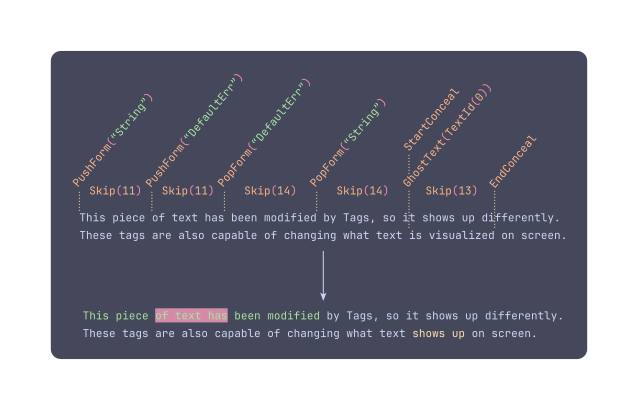

# Architecture

This document details the inner workings of Duat, if you wish to familiarize yourself with the high level design, in order to contribute to the code.

# Overview

Duat is primarily composed of two crates, `duat-core` and `duat`. The former contains all of the API that can be used by plugins in order to extend Duat, while the latter is comprised of two "crates" (one for `"main.rs"` and another for `"lib.rs"`:

* A crate that will run Duat, by lib-loading the config crate in `"$CONFIG_DIR"`;
* A crate that provides an API to create a function that can be libloaded, as well as streamlined APIs from `duat-core`.

## Why is this done like this?

The main reason for doing this is so there can be a crate (`duat`) that can handle all of the APIs provided by `duat-core` without worrying about the `Ui` that is being used.

If you look at any part of the code in `duat-core`, you will notice a lot of `<U>`s, all over the place. These are generic implementations of the `Ui` that Duat might be using. These need to exist, since implementations of widgets, printing, how input is handled, and all sorts of other things can change, based on what `Ui` is being used.

By providing an abstraction layer above `duat-core`, these `<U>`s can be completely removed in the config crate, making for a much more streamlined and friendly user experience. This separation also comes with the huge benefit of being able to choose the `Ui` at compile time of `duat` (through `cfg`s), thus allowing me to publish these crates to `crates.io`.

The reason why `duat` has a `"lib.rs"` and a `"main.rs"` is so that they are forced to be syncronized with the same `Ui` crate, and objectively, less crates is better.

# The `duat-core` crate

`duat-core` is where the majority of APIs are defined, and is the crate intended for use by plugins, so they can be generic over different `Ui`s. The crate contains APIs for the creation of widgets, input methods, commands, colorschemes (internally called `FormPalette`s), asynchronous data (in the form of `RwData` and `RoData`), and `Text`, the struct that Duat uses in order to render stylized strings.

## The module `src/text`

If `duat-core` is the core of Duat, the module `src/text` is the core of `duat-core`. It defines the `Text` struct, which is comprised primarily of two `GapBuffer`s, one for the bytes of the text, and another for the `Tag`s used in the text.

### `Tags` and the module `src/text/tags`

`Tag`s are how text is modified, currently, in the following ways:

* Changes of style (or `Form`s);
* Changes of alignment;
* Concealment of text, for code folding and replacement;
* Ghost text, i.e. text that is added, but cannot be interacted with;
* Buttons, which can accept clicks and hover events;

The `GapBuffer` for the tags holds an enum, `TagOrSkip`. This enum defines either a `RawTag`, to be placed in the current position, or a skip, which tells you were the next tag is.

This organisation is very memory efficient, lets Duat put any number of tags in the same spot, and makes iteration over the struct really fast.

