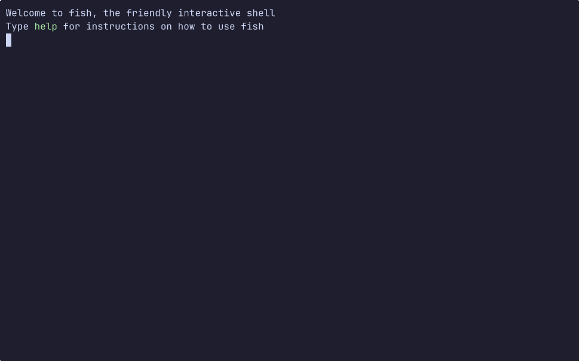

# duat


[](https://crates.io/crates/duat)
[](https://docs.rs/duat)
[](https://github.com/AhoyISki/duat)
[](https://ahoyiski.github.io/duat)



Duat is a text editor with sane defaults, while still having an
incredible amount of modularity, to the point where you can
replace pretty much anything.

It is written *and configured* in Rust, through the use of a
config crate. The configuration can then be reloaded without
closing Duat, by being recompiled as requested.

I know that Rust isn’t *really* a scripting language, but I’ve
worked really hard to make this API intuitive to use, whilst still
maintaining all the safety and expressiveness that Rust is known
for.

Rust is also known for long compile times, but for Duat, I’ve
managed to reduce the vast majority of reloads to under ~1.3
seconds, with a large chunk taking less than 800 ms (on my
relatively old mid range laptop).

Do keep in mind that this is a work in progress, so there might be
bugs. Any feedback on features, bugs or requests is highly
appreciated 🥰.

### Installation

To install Duat, I am assuming that you have `cargo` installed on
your system, if you don’t, [install it][__link0]. If you are installing it
on Windows, you should additionlly follow the instructions that
they give you for installing C/C++ libraries through Visual
Studio.

## Note

On this section, I will be referring to duat’s configuration by
`~/.config/duat/`, but you should replace it with your operating
system’s config path. The same also applies to `~/.local/duat/`.

After installing `cargo`, you will also need to install the
`nightly` toolchain:

#### On unix-like operating systems

```bash
rustup install nightly
```

#### On Windows

```bash
rustup install nightly-x86_64-pc-windows-gnu
```

Next, in order to run duat, you should add `~/.cargo/bin/` to your
`$PATH` variable. Alternatively, you can just add
`~/.cargo/bin/duat`, if you want to add just `duat` to the
`$PATH`. Now, you can install duat:

```bash
cargo install duat
```

That is the recommended version, however, if you wish to install
the *bleeding edge* version, you can call this instead:

```bash
cargo install --git https://github.com/AhoyISki/duat --features git-deps
```

### Configuration

When you first run `duat`, you will be prompted for the creation
of a new configuration crate in `~/.config/duat/` (unless it
already exists).

In the configuration’s `src/lib.rs`, there should be a
`setup_duat!` macro, which takes in a function with no parameters.

This function is the setup for duat, and it can be empty, which is
the equivalent of the default configuration for Duat.

Here’s an example configuration buffer, which makes use of the
`duat-kak` crate, which is a plugin for Duat. This plugin, like
all others, is included without the `duat_` prefix, so in the
config it is just `kak`.

```rust
setup_duat!(setup);
use duat::prelude::*;

fn setup() {
    map::<kak::Insert>("jk", "<Esc>");

    opts::set(|opts| {
        opts.wrap_lines = true;
        opts.scrolloff.y = 5;
    });

    opts::set_lines(|opts| {
        opts.align = std::fmt::Alignment::Right;
    });

    opts::set_status(|pa| {
        let upper_mode = mode_name().map(|m| m.to_uppercase());

        status!("[mode]{upper_mode}{Spacer}{name_txt} {sels_txt} {main_txt}")
    });

    hook::add::<ModeSwitched>(|_, (_, new)| {
        match new {
            "Insert" => cursor::set_main(CursorShape::SteadyBar),
            _ => cursor::unset(),
        }
        Ok(())
    });

    form::set("mode", Form::dark_magenta());
}
```

This configuration does the following things:

* [Maps][__link1] jk to esc in the `Insert` mode;
* Sets [options][__link2] for the `Buffer`, `LineNumbers` and `StatusLine`
* [Adds][__link3] hooks for [mode changes][__link4] in Duat, which change the shape
  of the cursor;
* [Changes][__link5] the [style][__link6] of the mode printed on the
  status line;

These are only some of the options available to configure Duat,
you can also add [custom commands][__link7], place widgets around other
[`Widget`][__link8]s and [windows][__link9], create [`Parser`][__link10]s that can track every
change on a [`Buffer`][__link11], and many other things.

Duat also comes with a fully fledged [text creation system][__link12], which
significantly eases the creation of highly formatted text:

```rust
let infix = "text";

let text = txt!("This {infix} is [form1]colored and {Spacer} distant");
```

In the example above, `[form1]` will change the style of the text
to the `"form1"` [`Form`][__link13], while `{Spacer}` will place a [spacer][__link14]
in between the two parts of the text (See the status line in the
GIF, it uses spacers).

This macro works very similarly to the [`format!`][__link15] family of
macros, so you also have inlining, as you can see with the
`{infix}` part. All of this is, of course, checked at compile
time.

## Troubleshooting

These issues asume that you are working with the `--git-deps`
version of `duat`

### The configuration fails to compile/recompile

Try running the following:

```bash
duat --reload --clean
```

This will update all dependencies of the config, potentially
solving compatibility issues. The problem may also be with some
plugin you installed.

### It’s segfaulting as I reopen!

This is an indication that your installed version of duat became
incompatible with that of your config. Rerun the installation
process and call `duat --reload`.

## Default plugins

When you install duat, the default config crate will come with
the following plugins:

* [`duat-catppuccin`][__link16] is a just a simple colorscheme plugin, it
  adds the four flavors from the [catppuccin][__link17] colorscheme. You can
  pick between the four of them, you can apply its colors to other
  [`Form`][__link18]s and you can allow or disallow the colorscheme to set
  the background color.

It also comes with the following built-in plugins, which I will
later on add the ability to disable:

* [`duatmode`][__link19] is the default mode for editing in Duat. It is
  heavily inspired by the Kakoune text editor in its design, with
  some light differences.
* [`duat-treesitter`][__link20] brings [tree-sitter][__link21] to Duat in the form of
  syntax highlighting and indentation calculation, which can be
  used by Modes (such as those from `duat-kak`) in order to give
  better feedback when editing buffers.
* [`duat-match-pairs`][__link22] adds matched parentheses highlighting to
  duat. Has some ntegration with `duat-treesitter`.
* [`duat-base`][__link23] adds all of the default plugins that you see, like
  the line numbers, status line, prompt line, etc.

### Features

Duat provides a lot of features, trying to be as configurable as
possible, here are some of the things that Duat is capable of:

* Completely custom modes, with full Vim style remapping;
* Completely custom widgets, with user created modes;
* Arbitrary concealment of text, and arbitrary ghost text;
* Custom hooks, whose activation is up to the creator;
* Custom commands, with customizable parameters supported by;
  Rust’s robust type system;
* Multi UI adaptability, although for now, only a terminal UI has
  been made;
* And many others still being planned;

Additionally, by choosing Rust as its configuration language, Duat
also gains the following features:

* Complete type safety;
* A very functional programming language, with lots of native
  features;
* Cargo is the plugin manager;

### Roadmap

These are the goals that have been accomplished or are on their
way:

* [x] Implement basic visual functionality (printing, scrolling,
  etc);
* [x] Implement wrapping;
* [x] Implement editing;
* [x] Create a kak mode;
* [x] Implement the use of multiple cursors;
* [x] Implement a history system;
* [x] Implement colors;
* [x] Implement widgets and designated areas;
* [x] Make all of these things easy to use on a public interface;
* [x] Create a number line and a separator line;
* [x] Create a status line;
* [x] Buffer switching;
* [x] Create a command creation interface and a command line;
* [x] Add the ability to frame areas;
* [x] Implement concealment;
* [x] Implement hot reloading of configuration;
* [x] Create a “normal editing” mode;
* [x] Add the ability to create hooks;
* [x] Create a more generalized plugin system;
* [x] Implement incremental Regex searching;
* [x] Implement tree-sitter;
* [x] Add floating widgets, not tied to the session layout;
* [x] Implement autocompletion lists;
* [ ] Create an LSP plugin;
* [ ] Create a vim mode;

︙

* [ ] Create an gui frontend;

An internal (and more detailed) TODO list, which might hard to
understand, can be found in [TODO][__link24]. This list will is
*not* a comprehensive roadmap, as I will ocasionally remove
entries from it, particularly those in the `FOR NEXT UPDATE`
section, when said update comes out.

**NOTE:** These are not set in stone, and may be done out of
order.

### Why should I use this?

I don’t know what your personal reasoning would be, but in my
case, I really like Kakoune’s editing model, but was frustrated
with the lack of some features, like folding, multiple buffer
editing, the general barebonesness of the configuration, etc.

I know that Neovim has all of these features, and Helix supposedly
tries to solve some of these issues. But I don’t really like
either of their editing styles to be honest.

And so I thought, why not make my own text editor?

I thought, why not make a text editor that is as modular as
possible, while still having a sensible default configuration?
That I could modify however I wanted, and with a language that I
love?

That’s why I decided to create Duat.

### Why the name

idk, cool sounding word that I got from Spelunky 2.


 [__cargo_doc2readme_dependencies_info]: ggGkYW0BYXSEG28twsakgeweG89ory0HETUFG8cwEFhxMqC5GzP5sGaT2qvKYXKEG3Pc6bLSyQGtGwqDXK28Wq_zGwM8txzqOm0YG0OFYhg9S4IaYWSGgmRkdWF0ZTAuNy4xgmlkdWF0X2Jhc2VlMC43LjCCaWR1YXRfY29yZWUwLjcuMIJwZHVhdF9tYXRjaF9wYWlyc2UwLjIuMYJvZHVhdF90cmVlc2l0dGVyZTAuMy4xgmhkdWF0bW9kZWUwLjcuMA
 [__link0]: https://www.rust-lang.org/tools/install
 [__link1]: https://docs.rs/duat/0.7.1/duat/?search=mode::map
 [__link10]: https://docs.rs/duat_core/0.7.0/duat_core/?search=buffer::Parser
 [__link11]: https://docs.rs/duat/0.7.1/duat/?search=prelude::Buffer
 [__link12]: https://docs.rs/duat_core/0.7.0/duat_core/?search=text::txt
 [__link13]: https://docs.rs/duat/0.7.1/duat/?search=prelude::Form
 [__link14]: https://docs.rs/duat_core/0.7.0/duat_core/?search=text::Spacer
 [__link15]: https://doc.rust-lang.org/stable/std/macro.format.html
 [__link16]: https://github.com/AhoyISki/duat-catppuccin
 [__link17]: https://catppuccin.com
 [__link18]: https://docs.rs/duat/0.7.1/duat/?search=prelude::Form
 [__link19]: https://crates.io/crates/duatmode/0.7.0
 [__link2]: https://docs.rs/duat/0.7.1/duat/opts/index.html
 [__link20]: https://crates.io/crates/duat_treesitter/0.3.1
 [__link21]: https://tree-sitter.github.io/tree-sitter
 [__link22]: https://crates.io/crates/duat_match_pairs/0.2.1
 [__link23]: https://crates.io/crates/duat_base/0.7.0
 [__link24]: ./TODO
 [__link3]: https://docs.rs/duat/0.7.1/duat/?search=hook::add
 [__link4]: https://docs.rs/duat/0.7.1/duat/?search=hook::ModeSwitched
 [__link5]: https://docs.rs/duat/0.7.1/duat/?search=form::set
 [__link6]: https://docs.rs/duat/0.7.1/duat/?search=form::Form
 [__link7]: https://docs.rs/duat/0.7.1/duat/?search=prelude::cmd
 [__link8]: https://docs.rs/duat/0.7.1/duat/?search=widgets::Widget
 [__link9]: https://docs.rs/duat/0.7.1/duat/?search=hook::WindowCreated
