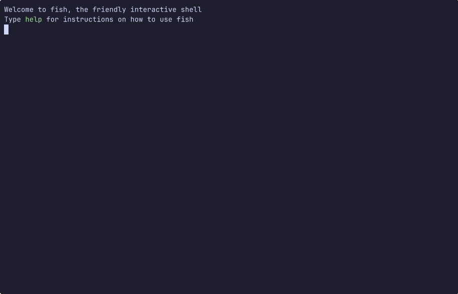

# duat


[](https://crates.io/crates/duat)
[](https://docs.rs/duat)
[](https://github.com/AhoyISki/duat)
[](https://github.com/AhoyISki/duat/actions/workflows/mdbook.yml)



Duat is a text editor meant to have as much modularity as
possible, while keeping a sensible default configuration. It is
written *and configured* in Rust, through the use of a
configuration Rust crate, placed in `~/.config/duat/` (or wherever
`$XDG_CONFIG_HOME` is set to).

When installing Duat, this crate will be automatically placed in
that spot, and it will have a default example configuration.

When you first run Duat, and whenever you update the
configuration, it will be compiled and reloaded automatically, so
you can see the changes in *almost* real time. Initially, building
Duat and its configuration crate might take a few minutes. And the
first reload might also take a similar amount of time. But
whenever you make new changes, the next reloads should take only
about a second (for debug profile) and ~3 seconds (for release
profile).

Note that this is an alpha project, so there may be some quirks
and bugs. So if you have a problem, or something seems confusing,
feel free to ask questions or raise an issue, that would be very
welcome 🥰.

### Getting started

To install Duat, I am assuming that you have `cargo` installed on
your system, if you don’t, [install it][__link0]. Additionally, you’re
going to need the nightly toolchain installed, since Duat requires
many nightly features:

```bash
rustup install nightly
```

Also, in order to run duat, you should add `~/.cargo/bin/` to your
`$PATH` variable. Alternatively, you can just add
`~/.cargo/bin/duat`, if you want to add just `duat` to the
`$PATH`. Now, you can install duat:

```bash
cargo install duat
```

Although, since this is an alpha, I would recommend the git
version, since that is kept much  more up to date:

```bash
cargo install --git https://github.com/AhoyISki/duat --force --features git-deps
```

And if you want to nuke your config in order to get the newest
default config crate, you can do the following:

```bash
rm -rf ~/.config/duat
cargo install --git https://github.com/AhoyISki/duat --force --features git-deps
```

### Configuration

In the configuration file, there should be a `setup_duat!` macro,
which takes in a function with no parameters.

This function is the setup for duat, and it can be empty, which is
the equivalent of the default configuration for Duat.

Here’s an example configuration file, which makes use of the
`duat-kak` crate, which is a plugin for Duat. This plugin, like
all others, is included without the `duat_` prefix, so in the
config it is just `kak`.

```rust
setup_duat!(setup);
use duat::prelude::*;

fn setup() {
    plug!(treesitter::TreeSitter, kak::Kak::new(),);
    map::<kak::Insert>("jk", "<Esc>");

    print::wrap_on_edge();

    hook::add::<LineNumbers<Ui>>(|pa, (line_nums, _)| {
        line_nums.align_right().align_main_left()
    });

    hook::remove("WindowWidgets");
    hook::add::<OnWindowOpen>(|pa, builder| {
        let upper_mode = mode_name().map(|m| match m.split_once('<') {
            Some((no_generics, _)) => no_generics.to_uppercase(),
            None => m.to_uppercase(),
        });
        let status_line = status!("[Mode]{upper_mode}{Spacer}{file_fmt} {sels_fmt} {main_fmt}");

        builder.push(pa, FooterWidgets::new(status_line));
    });

    hook::add::<ModeSwitched>(|_, (_, new)| match new {
        "Insert" => cursor::set_main(CursorShape::SteadyBar),
        _ => cursor::set_main(CursorShape::SteadyBlock),
    });

    form::set("Mode", Form::dark_magenta());
}
```

This configuration does the following things:

* [plugs][__link1] the `Kak` plugin, which changes the [default mode][__link2], and
  the `TreeSitter` plugin, which adds syntax highlighting and is
  also used by the `Kak` plugin;
* [Maps][__link3] jk to esc in the `Insert` mode;
* [Changes][__link4] the wrapping;
* Changes the alignment of the [`LineNumbers`][__link5] [`Widget`][__link6];
* [Removes][__link7] the hook group “WindowWidgets”;
* Pushes a [custom status line][__link8] (with a [Spacer][__link9] for 2 separate
  sides, and a reformatted [`mode_name`][__link10]), a [command line][__link11], and a
  [notifications widget][__link12] to the bottom of the screen through a
  [widget combo][__link13];
* [Adds][__link14] hooks for [mode changes][__link15] in Duat;
* [Changes][__link16] the [style][__link17] of the mode printed on the
  status line;

These are some of the ways you can configure Duat. You might
notice some things that can be done with these simple options:

```rust
use duat::prelude::*;
hook::add::<OnFileOpen>(|pa, builder| {
    builder.push(pa, VertRule::cfg());
    builder.push(pa, LineNumbers::cfg());
    builder.push(pa, VertRule::cfg().on_the_right());
    builder.push(pa, LineNumbers::cfg().on_the_right());
});
```

Now, every file will open with two lines of numbers, one on each
side. Would you ever want to do this? …No, not really, but it
shows how configurable Duat can be.

Duat also comes with a fully fledged [text creation system][__link18], which
significantly eases the creation of widgets:

```rust
let text = txt!("[my_form]Waow it's my form![]not anymore 😢");
```

In this example, I’m using the “my_form” form in order to style
the text, while `[]` reverts back to the “default” form. Double
`[[` and `]]` escape the `[` and `]`, just like in [`println!`][__link19].
The [`status!`][__link20] macro works similarly.

Duat also has a simple command system, that lets you add commands
with arguments supported by Rust’s type system. As an example,
this command will change the [numbering][__link21] of a [`LineNumbers`][__link22]
widget, switching between absolute and relative numbering.

## Troubleshooting

These issues asume that you are working with the `--git-deps`
version of `duat`

### The configuration fails to compile/recompile

Try running this in `~/.config/duat`:

```bash
cargo clean && cargo update && cargo build --release
```

This could solve inconsistencies in the API, given that it could
change without the plugins being aware of those changes.

### It still fails to compile!

In this case, you should open an issue with the error message that
`cargo build --release` sent you.

### It’s segfaulting sometimes when I reload

For now, since duat is using `dlopen`, it’s unfortunatelly just
going to happen from time to time. It should work correctly if you
reopen though.

This should be a problem of the past with [\#9][__link23], however.

### It’s still segfaulting as I reopen!

This is an indication that your installed version of duat became
incompatible with that of your config. Rerun the installation
process, no need to remove `~/.config/duat`.

### It’s still segfaulting!

In that case open an issue

## Default plugins

When you install duat, the default config crate will come with
some preinstalled plugins:

* [`duat-kak`][__link24] is a plugin that changes the default mode of Duat
  to one inspired by [Kakoune][__link25]’s “Normal”, also bringing with it
  various other modes from Kakoune.
* [`duat-catppuccin`][__link26] is a just a simple colorscheme plugin, it
  adds the four flavors from the [catppuccin][__link27] colorscheme. You can
  pick between the four of them, you can apply its colors to other
  [`Form`][__link28]s and you can allow or disallow the colorscheme to set
  the background color.
* [`duat-treesitter`][__link29] brings [tree-sitter][__link30] to Duat in the form of
  syntax highlighting and indentation calculation, which can be
  used by Modes (such as those from `duat-kak`) in order to give
  better feedback when editing files.

You can, of course, unplug these by not calling [`plug!`][__link31], or you
could remove them entirely by taking them out of the
`Cargo.toml`’s [dependencies section][__link32].

### Features

Duat provides a lot of features, trying to be as configurable as
possible, here are some of the things that Duat is capable of:

* Completely custom modes, with full Vim style remapping
* Completely custom widgets, with user created modes
* Arbitrary concealment of text, and arbitrary ghost text
* Custom hooks, whose activation is up to the creator
* Custom commands, with customizable parameters supported by
  Rust’s robust type system
* Multi UI adaptability, although for now, only a terminal UI has
  been made
* And many others still being planned

Additionally, by choosing Rust as its configuration language, Duat
also gains the following features:

* Complete type safety
* A very functional programming language, with lots of native
  features
* Cargo is the plugin manager

### Roadmap

These are the goals that have been accomplished or are on their
way:

* [x] Implement basic visual functionality (printing, scrolling,
  etc);
* [x] Implement wrapping;
* [x] Implement editing;
* [x] Create a kak mode;
* [x] Implement the use of multiple cursors;
* [x] Implement a history system;
* [x] Implement colors;
* [x] Implement widgets and designated areas;
* [x] Make all of these things easy to use on a public interface;
* [x] Create a number line and a separator line;
* [x] Create a status line;
* [x] File switching;
* [x] Create a command creation interface and a command line;
* [x] Add the ability to frame areas;
* [x] Implement concealment;
* [x] Implement hot reloading of configuration;
* [x] Create a “normal editing” mode;
* [x] Add the ability to create hooks;
* [x] Create a more generalized plugin system;
* [x] Implement incremental Regex searching;
* [x] Implement tree-sitter;
* [ ] Add floating widgets, not tied to the session layout;
* [ ] Implement autocompletion lists;
* [ ] Create an LSP plugin;
* [ ] Create a vim mode;

︙

* [ ] Create an Iced frontend;

**NOTE:** These are not set in stone, and may be done out of
order.

### Why should I use this?

I don’t know what your personal reasoning would be, but in my
case, I really like Kakoune’s editing model, but was frustrated
with the lack of some features, like folding, multiple file
editing, the general barebonesness of the configuration, etc.

I know that Neovim has all of these features, and Helix supposedly
tries to solve some of these issues. But I don’t really like
either of their editing styles to be honest.

And so I thought, why not make my own text editor?

I thought, why not make a text editor that is as modular as
possible, while still having a sensible default configuration?
That I could modify however I wanted, and with a language that I
love?

That’s why I decided to create Duat.

### Why the name

idk, cool sounding word that I got from Spelunky 2.

Also, just wanted to say that no AI was used in this project, cuz
I don’t like it.


 [__cargo_doc2readme_dependencies_info]: ggGkYW0BYXSEGydn-vM2BnHlG4pkOQYK8QlOGzd5wvydoS9JG9IOMNNM_Z3XYXKEGzZGRmQtqxvrGxTmApwft5AXG6zUv9_BpoWaG7ERMCtHr0LMYWSCgmRkdWF0ZTAuNS4zgmpkdWF0X3V0aWxzZTAuMi4x
 [__link0]: https://www.rust-lang.org/tools/install
 [__link1]: https://docs.rs/duat/0.5.3/duat/?search=prelude::plug
 [__link10]: https://docs.rs/duat/0.5.3/duat/?search=prelude::mode_name
 [__link11]: https://docs.rs/duat/0.5.3/duat/?search=prelude::PromptLine
 [__link12]: https://docs.rs/duat/0.5.3/duat/?search=prelude::Notifications
 [__link13]: https://docs.rs/duat/0.5.3/duat/?search=prelude::FooterWidgets
 [__link14]: https://docs.rs/duat/0.5.3/duat/?search=prelude::hook::add
 [__link15]: https://docs.rs/duat/0.5.3/duat/?search=prelude::hook::ModeSwitched
 [__link16]: https://docs.rs/duat/0.5.3/duat/?search=form::set
 [__link17]: https://docs.rs/duat/0.5.3/duat/?search=prelude::form::Form
 [__link18]: https://docs.rs/duat/0.5.3/duat/?search=prelude::text::txt
 [__link19]: https://doc.rust-lang.org/stable/std/macro.println.html
 [__link2]: https://docs.rs/duat/0.5.3/duat/?search=prelude::mode::set_default
 [__link20]: https://docs.rs/duat/0.5.3/duat/?search=prelude::status
 [__link21]: https://docs.rs/duat_utils/0.2.1/duat_utils/?search=widgets::LineNumbersOptions::rel_abs
 [__link22]: https://docs.rs/duat/0.5.3/duat/?search=prelude::LineNumbers
 [__link23]: https://github.com/AhoyISki/duat/issues/9
 [__link24]: https://github.com/AhoyISki/duat-kak
 [__link25]: https://github.com/mawww/kakoune
 [__link26]: https://github.com/AhoyISki/duat-catppuccin
 [__link27]: https://catppuccin.com
 [__link28]: https://docs.rs/duat/0.5.3/duat/?search=prelude::Form
 [__link29]: https://github.com/AhoyISki/duat-treesitter
 [__link3]: https://docs.rs/duat/0.5.3/duat/?search=prelude::map
 [__link30]: https://tree-sitter.github.io/tree-sitter
 [__link31]: https://docs.rs/duat/0.5.3/duat/?search=prelude::plug
 [__link32]: https://doc.rust-lang.org/cargo/reference/specifying-dependencies.html
 [__link4]: https://docs.rs/duat/0.5.3/duat/?search=prelude::print::wrap_on_edge
 [__link5]: https://docs.rs/duat/0.5.3/duat/?search=prelude::LineNumbers
 [__link6]: https://docs.rs/duat/0.5.3/duat/?search=prelude::Widget
 [__link7]: https://docs.rs/duat/0.5.3/duat/?search=prelude::hook::remove
 [__link8]: https://docs.rs/duat/0.5.3/duat/?search=prelude::status
 [__link9]: https://docs.rs/duat/0.5.3/duat/?search=prelude::Spacer
