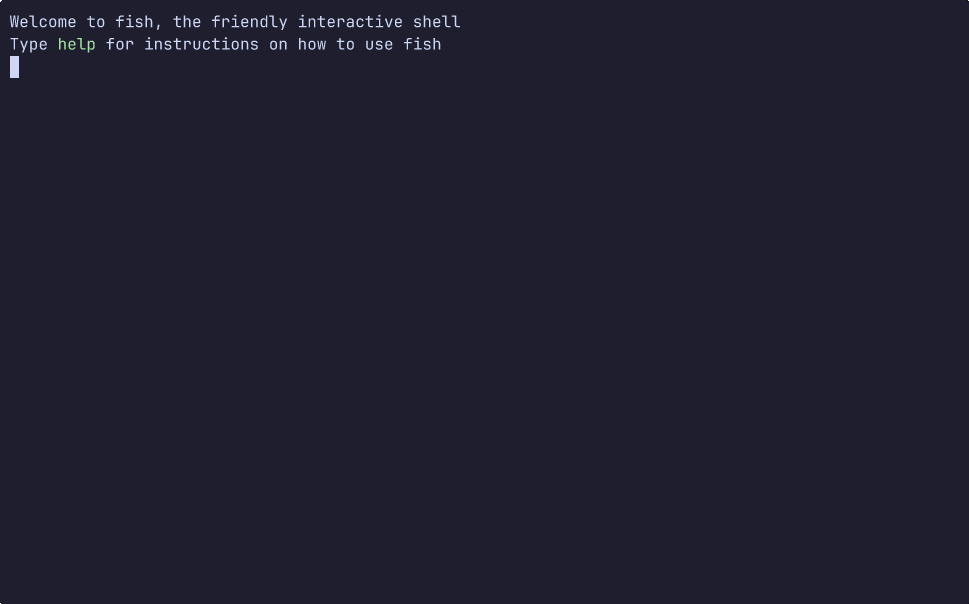

# duat


[](https://crates.io/crates/duat)
[](https://docs.rs/duat)
[](https://github.com/AhoyISki/duat)
[](https://ahoyiski.github.io/duat)



Duat is a modern text editor, with great defaults and even greater
extensibility. It is heavily inspired by [Kakoune][__link0], which means
it has first class support for multiple selections, via selection
first modal editing.

It is written *and configured* in Rust, through the use of a
config crate. The configuration can then be reloaded without
closing Duat, by being recompiled as requested.

The use of Rust brings a lot of benefits, not only for its
(in)famous memory safety, but also the general stability of
the language and great tooling. As a benefit for example, cargo
is my plugin manager, which works out really well.

Rust is also known for long compile times, but for Duat, I’ve
managed to reduce the vast majority of reloads to under 1 second,
with a large chunk taking less than 700 ms (on my 7 year old budget
gaming laptop).

Do keep in mind that this is a work in progress, so there might be
bugs. Any feedback on features, bugs or requests is highly
appreciated 🥰.

### Installation

To install Duat, I am assuming that you have `cargo` installed on
your system, if you don’t, [install it][__link1]. If you are installing it
on Windows, you should additionlly follow the instructions that
they give you for installing C/C++ libraries through Visual
Studio.

## Note

On this section, I will be referring to duat’s configuration by
`~/.config/duat/`, but you should replace it with your operating
system’s config path.

Next, in order to run duat, you should add `~/.cargo/bin/` to your
`$PATH` variable. Alternatively, you can just add
`~/.cargo/bin/duat`, if you want to add just `duat` to the
`$PATH`.

Now, you can install duat:

```bash
cargo install duat
duat --cfg
```

That is the recommended version, however, if you wish to install
the *bleeding edge* version, you can call this instead:

```bash
cargo install --git https://github.com/AhoyISki/duat
duat --cfg
```

And in the prompt, you will say `y` to the question about
depending on the git version of Duat.

### Configuration

When you first run `duat`, you will be prompted for the creation
of a new configuration crate in `~/.config/duat/` (unless it
already exists).

In the configuration’s `src/lib.rs`, there should be a
`setup_duat!` macro, which takes in a function with a `&mut Opts`
parameter, for initial config options.

This function is the setup for duat, and it can be empty, which is
the equivalent of running the default configuration for Duat.

Here’s a config example. Note the usage of type arguments to allow
for compile time guarantees:

```rust
setup_duat!(setup);
use duat::prelude::*;

fn setup(opts: &mut Opts) {
    map::<Insert>("jk", "<Esc>");

    opts.wrap_lines = true;
    opts.scrolloff.y = 5;
    opts.linenumbers.align = std::fmt::Alignment::Right;
    opts.fmt_status(|pa| {
        let upper_mode = mode_name().map(|m| m.to_uppercase());

        status!("[mode]{upper_mode}{Spacer}{name_txt} {sels_txt} {main_txt}")
    });

    hook::add::<ModeSwitched>(|_, switch| match switch.new.name {
        "Insert" => cursor::set_main(CursorShape::SteadyBar),
        _ => cursor::unset(),
    });

    form::set("mode", Form::new().dark_magenta());
    colorscheme::set("catppuccin-mocha");
}
```

This configuration does the following things:

* Maps jk to esc in the `Insert` mode;
* Sets options for the `Buffer`, `LineNumbers` and `StatusLine`
* Adds hooks for mode changes in Duat, which change the shape
  of the cursor;
* Changes the style of the mode printed on the status line;
* Sets a colorscheme

These are only some of the options available to configure Duat,
you can also add custom commands, completely change the layout with
your own widgets, create custom modes (like vim, emacs, or helix),
and many other things!

Duat also comes with many builtin features, like an lsp-server,
tree-sitter support, snippets, a whichkey widget, and
even multi-step completion.

### Features

Duat provides a lot of features, trying to be as configurable as
possible, here are some of the things that Duat is capable of:

* Completely custom modes, with full Vim style remapping.
* Completely custom widgets, floating or part of the UI.
* A fantastic `Text` system, allowing for easy and flexible
  creation of visual interfaces.
* Custom hooks, whose activation is up to the creator.
* Custom commands, with customizable parameters supported by Rust’s
  robust type system.
* Multi UI adaptability, although for now, only a terminal UI has
  been made.
* And many others.

Additionally, by choosing Rust as its configuration language, Duat
also gains the following features:

* Complete type safety;
* A very functional programming language, with great compile time
  guarantees;
* Fantastic tooling and a great ecosystem.
* Cargo is the plugin manager;

### Roadmap

These are the goals that have been accomplished or are on their
way:

* [x] Implement basic visual functionality (printing, scrolling,
  etc);
* [x] Implement wrapping;
* [x] Implement editing;
* [x] Create a kak mode;
* [x] Implement the use of multiple cursors;
* [x] Implement a history system;
* [x] Implement colors;
* [x] Implement widgets and designated areas;
* [x] Make all of these things easy to use on a public interface;
* [x] Create a number line and a separator line;
* [x] Create a status line;
* [x] Buffer switching;
* [x] Create a command creation interface and a command line;
* [x] Add the ability to frame areas;
* [x] Implement concealment;
* [x] Implement hot reloading of configuration;
* [x] Create a “normal editing” mode;
* [x] Add the ability to create hooks;
* [x] Create a more generalized plugin system;
* [x] Implement incremental Regex searching;
* [x] Implement tree-sitter;
* [x] Add floating widgets, not tied to the session layout;
* [x] Implement autocompletion lists;
* [x] Create an LSP plugin;
* [ ] Create a vim mode;

︙

* [ ] Create a gui frontend;

An internal (and more detailed) TODO list, which might hard to
understand, can be found in [TODO][__link2]. This list is *not*
a comprehensive roadmap, as I will ocasionally remove entries
from it, particularly those at the top section, which are meant
for a specific update.

**NOTE:** These are not set in stone, and may be done out of
order.

### Why should I use this?

I don’t know what your personal reasoning would be, but in my
case, I really like Kakoune’s editing model, but was frustrated
with the lack of some features, like folding, multiple buffer
editing, the general barebonesness of the configuration, etc.

I know that Neovim has all of these features, and Helix supposedly
tries to solve some of these issues. But I don’t really like
either of their editing styles to be honest.

And so I thought, why not make my own text editor?

I thought, why not make a text editor that is as modular as
possible, while still having a sensible default configuration,
that I could modify however I wanted, and with a language that I
love?

That’s why I decided to create Duat.

### Why the name

idk, cool sounding word that I got from Spelunky 2.


 [__link0]: https://github.com/mawww/kakoune
 [__link1]: https://www.rust-lang.org/tools/install
 [__link2]: ./TODO
