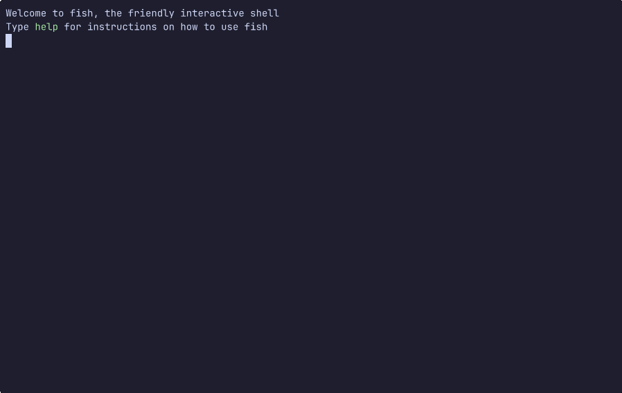

# duat-core  [](https://crates.io/crates/duat-core) [](https://docs.rs/duat-core) [](https://github.com/AhoyISki/duat/tree/master/duat-core)

The core of Duat, this crate is meant to be used only for the
creation of plugins for Duat.

The capabilities of `duat-core` are largely the same as the those
of Duat, however, the main difference is the multi [`Ui`][__link0] APIs of
this crate. In it, the public functions and types are defined in
terms of `U: Ui`,  which means that they can work on various
different interfaces:

## Quick Start

This crate is composed of a few main modules, which will be used
in order to extend Duat:

* [`ui`][__link1]: Has everything to do with the interface of Duat, that
  includes things like:
  
  * [`Widget`][__link2]s: As the name implies, this is the trait for
    objects that will show up on the screen. The most noteworthy
    [`Widget`][__link3] is [`File`][__link4], which displays the contents of a file.
  * [`WidgetCfg`][__link5]s: These are [`Widget`][__link6] builders. They are used
    in the `setup` function of Duat’s config, through the
    [`WidgetCreated`][__link7] and [`WindowCreated`][__link8] [hook][__link9]s.
  * [`Ui`][__link10] and [`Area`][__link11]s: These are used if you want to create
    your own interface for Duat. Very much a work in progress, so
    I wouldn’t recommend trying that yet.
* [`text`][__link12]: Defines the struct used to show characters on screen
  
  * [`Text`][__link13]: Is everything that Duat shows on screen (except
    [`Ui`][__link14] specific decorations). This includes a UTF-8 string and
    tags to modify it.
  * [`Tag`][__link15]s: This is how Duat determines how [`Text`][__link16] will be
    displayed on screen. There are tags for styling, text
    alignment, spacing and all sorts of other things.
  * [`txt!`][__link17]: This macro, with syntax reminiscent of [`format!`][__link18]
    from Rust’s [`std`][__link19],  can be used to create [`Text`][__link20] through
    the [`text::Builder`][__link21] struct.
* [`mode`][__link22]: Defines how Duat will take input in order to control
  [`Widget`][__link23]s, includes things like:
  
  * [`Mode`][__link24]s: have the function [`send_key`][__link25], which
    takes a [key][__link26] and the current [widget][__link27] as input, and decides
    what to do with them. Only one [`Mode`][__link28] is active
    at any given time.
  * [`map`][__link29] and [`alias`][__link30]: These functions provide vim-style
    remapping on a given [`Mode`][__link31], also letting you
    switch modes on [key][__link32] sequences.
  * [`set`][__link33], [`set_default`][__link34], [`reset`][__link35]: These functions are used
    in order to switch [`Mode`][__link36] on demand. Do note
    that the switching is done asynchronously.
* [`hook`][__link37]: Provides utilities for hooking functions in Duat
  
  * [`Hookable`][__link38]: An event that you want to provide hooks for, in
    order to trigger functions whenever it takes place.
  * [`add`][__link39], [`add_grouped`][__link40], [`remove`][__link41]: These functions let you
    add or remove functions from [`Hookable`][__link42] events. Their
    arguments are statically determine by said [`Hookable`][__link43]s.
* [`cmd`][__link44]: Creation of commands in Duat, which can be called at
  runtime by the user.
  
  * [`add!`][__link45]: This macro lets you create a command, with one or
    more callers, and any number of [`Parameter`][__link46]s
  * [`Parameter`][__link47]: A command argument parsed from a string. There
    are a bunch of predefined [`Parameter`][__link48]s, and things like
    [`Vec<P>`][__link49] where `P: Parameter`, can also be as
    [`Parameter`][__link50]s, if you want multiple of the same kind.
  * [`call`][__link51], [`queue`][__link52], [`call_notify`][__link53], [`queue_and`][__link54], etc:
    functions to call or queue commands, which one should be used
    depends on the context of the function calling them.
* [`form`][__link55]: How to stylize [`Text`][__link56]
  
  * [`Form`][__link57]: Has many options on what [`Text`][__link58] should
    look like, are the same as those found on unix terminals.
  * [`set`][__link59], [`set_weak`][__link60]: These functions let you set
    forms with a name. They can be set to a [`Form`][__link61]
    or reference another name of a form.
  * [`ColorScheme`][__link62]s: These are general purpose
    [`Form`][__link63] setters, with a name that can be called
    from the `colorscheme` [command][__link64]

These are the elements available to you if you want to extend
Duat. Additionally, there are some other things that have been
left out, but they are available in the [`prelude`][__link65], so you can
just import it:

```rust
// Usually at the top of the crate, below `//!` comments:
use duat_core::prelude::*;
```

## How to extend Duat

Duat is extended primarily through the use of [`Plugin`][__link66]s from
external crates, these will be plugged in the main config through
the [`plug!`][__link67] macro, and are modified in place through the builder
pattern.

For this demonstration, I will create a [`Plugin`][__link68] that keeps
track of the word count in a [`File`][__link69], without reparsing it every
time said [`File`][__link70] changes.

### Creating a [`Plugin`][__link71]

First of all, assuming that you have succeeded in following the
[installation instructions of duat][__link72], you should create a crate
with `cargo init`:

```bash
cargo init --lib duat-word-count
cd duat-word-count
```

Wihin that crate, you’re should add the `duat-core` dependency:

```bash
cargo add duat-core
```

Or, if you’re using git dependencies:

```bash
cargo add duat-core --git https://github.com/AhoyISki/duat
```

Finally, you can remove everything in `duat-word-count/src/lib.rs`
and start writing your plugin.

```rust
// In duat-word-count/src/lib.rs
use duat_core::prelude::*;

/// A [`Plugin`] to count the number of words in [`File`]s
pub struct WordCount;

impl<U: Ui> Plugin<U> for WordCount {
    fn plug(self) {
        todo!();
    }
}
```

In the example, `WordCount` is a plugin that can be included in
Duat’s `config` crate. It will give the user the ability to get
how many words are in a [`File`][__link73], without having to reparse the
whole buffer every time, given that it could be a very large file.
In order to configure the [`Plugin`][__link74], you should make use of the
builder pattern, returning the [`Plugin`][__link75] on every modification.

```rust
use duat_core::prelude::*;

/// A [`Plugin`] to count the number of words in [`File`]s
pub struct WordCount(bool);

impl WordCount {
    /// Returns a new instance of the [`WordCount`] plugin
    pub fn new() -> Self {
        WordCount(false)
    }

    /// Count everything that isn't whitespace as a word character
    pub fn not_whitespace(self) -> Self {
        WordCount(true)
    }
}

impl<U: Ui> Plugin<U> for WordCount {
    fn plug(self) {
        todo!();
    }
}
```

Now, there is an option to exclude only whitespace, not just
including regular alphanumeric characters. This would count, for
example “x(x^3 + 3)” as 3 words, rather than 4.

Next, I need to add something to keep track of the number of words
in a [`File`][__link76]. For [`File`][__link77]s specifically, there is a built-in way
to keep track of changes through the [`Parser`][__link78] trait:

```rust
use duat_core::prelude::*;

/// A [`Parser`] to keep track of words in a [`File`]
struct WordCounter {
    words: usize,
    regex: &'static str,
}

impl<U: Ui> Parser<U> for WordCounter {
    fn parse(&mut self, pa: &mut Pass, snap: FileSnapshot, ranges: Option<&mut Ranges>) {
        todo!();
    }
}
```

Whenever changes take place in a [`File`][__link79], those changes will be
reported in a [`Moment`][__link80], which is essentially just a list of
[`Change`][__link81]s that took place. This [`Moment`][__link82], in a
[`FileSnapshot`][__link83], will be sent to the [`Parser::parse`][__link84] function,
in which you are supposed to change the internal state of the
[`Parser`][__link85] to accomodate the [`Change`][__link86]s.

The [`FileSnapshot`][__link87] gives you a “snapshot” of what the [`File`][__link88]
looked like after said [`Moment`][__link89] took place. It includes the
[`Moment`][__link90] in question, the [`Bytes`][__link91] of the [`File`][__link92]’s [`Text`][__link93],
and the [`PrintCfg`][__link94] at that moment in time.

First, I’m going to write a function that figures out how many
words were added or removed by a [`Change`][__link95]:

```rust
use duat_core::{prelude::*, text::Change};

fn word_diff(regex: &str, bytes: &Bytes, change: Change<&str>) -> i32 {
    let [start, _] = bytes.points_of_line(change.start().line());
    let [_, end] = bytes.points_of_line(change.added_end().line());

    // Recreate the line as it was before the change
    // behind_change is just the part of the line before the point
    // where a change starts.
    // ahead_of_change is the part of the line after the end of
    // the Change
    let mut behind_change = bytes.strs(start..change.start()).unwrap().to_string();
    let ahead_of_change = bytes.strs(change.added_end()..end).unwrap();
    // change.taken_str() is the &str that was taken by the Change
    behind_change.push_str(change.taken_str());
    // By adding these three together, I now have:
    // {behind_change}{change.taken_str()}{ahead_of_change}
    // Which is what the line looked like before the Change happened
    behind_change.extend(ahead_of_change);

    // Here, I'm just counting the number of occurances of the
    // regex in the line before and after the change.
    let words_before = behind_change.search_fwd(regex, ..).unwrap().count();
    let words_after = bytes.search_fwd(regex, start..end).unwrap().count();

    words_after as i32 - words_before as i32
}
```

In this method, I am calculating the difference between the number
of words in the line before and after the [`Change`][__link96] took place.
Here [`Bytes::points_of_line`][__link97] returns the [`Point`][__link98]s where a
line starts and ends. I know there are better ways to do this by
comparing the text that [was taken][__link99] to [what was added][__link100],
with the context of the lines of the change, but this is
just a demonstration, and the more efficient method is left as an
exercise to the viewer 😉.

Now, just call this on [`parse`][__link101]:

```rust
use duat_core::{prelude::*, text::Change};

/// A [`Parser`] to keep track of words in a [`File`]
struct WordCounter {
    words: usize,
    regex: &'static str,
}

impl<U: Ui> Parser<U> for WordCounter {
    fn parse(&mut self, pa: &mut Pass, snap: FileSnapshot, _: Option<&mut Ranges>) {
        // Rust iterators are magic 🪄
        let diff: i32 = snap
            .moment
            .changes()
            .map(|change| word_diff(self.regex, &snap.bytes, change))
            .sum();

        self.words = (self.words as i32 + diff) as usize;
    }
}
```

And that’s it for the [`Parser`][__link102] implementation! Now, how do we
add it to a [`File`][__link103]?

In order to add this [`Parser`][__link104] to a [`File`][__link105], we’re going to
need a [`ParserCfg`][__link106], which is used for configuring [`Parser`][__link107]s
before they are added:

```rust
use duat_core::prelude::*;

struct WordCounterCfg(bool);

impl<U: Ui> ParserCfg<U> for WordCounterCfg {
    type Parser = WordCounter;

    fn init(self, file: &File<U>) -> Result<ParserBox<U>, Text> {
        let regex = if self.0 { r"\S+" } else { r"\w+" };
        let words = file.bytes().search_fwd(regex, ..).unwrap().count();

        let word_counter = WordCounter { words, regex };
        Ok(ParserBox::new(file, word_counter))
    }
}
```

In this function, I am returning the `WordCounter`, with a
precalculated number of words (since I have to calculate this
value at some point), based on the current state of the [`File`][__link108].

The [`ParserBox`][__link109] return value is a wrapper for “constructing the
[`Parser`][__link110]”. To create a [`ParserBox`][__link111], there are two functions:
[`new`][__link112] and [`new_remote`][__link113]. The first one is essentially just a
wrapper around the [`Parser`][__link114]. The second one takes a closure that
will build the [`Parser`][__link115] in a second thread, this can be useful
if you want to create your [`Parser`][__link116] remotely.

One thing to note is that the [`Parser`][__link117] and [`ParserCfg`][__link118] can be
the same struct, it all depends on your constraints. For most
[`Parser`][__link119] implementations, that may not be the case, but for this
one, instead of storing a `bool` in `WordCounterCfg`, I could’ve
just stored the regex directly, like this:

```rust
use duat_core::prelude::*;

impl WordCounter {
    /// Returns a new instance of [`WordCounter`]
    pub fn new() -> Self {
        WordCounter { words: 0, regex: r"\w+" }
    }
}

impl<U: Ui> ParserCfg<U> for WordCounter {
    type Parser = Self;

    fn init(self, file: &File<U>) -> Result<ParserBox<U>, Text> {
        let words = file.bytes().search_fwd(self.regex, ..).unwrap().count();

        Ok(ParserBox::new(file, Self { words, ..self }))
    }
}
```

But the former is done for the purpose of demonstration, since (I
don’t think) this will be the case for most [`Parser`][__link120]s.

Now, to wrap this all up, the plugin needs to add this [`Parser`][__link121]
to every opened [`File`][__link122]. We do this through the use of a [hook][__link123]:

```rust
use duat_core::prelude::*;

/// A [`Plugin`] to count the number of words in [`File`]s
pub struct WordCount(bool);

impl WordCount {
    /// Returns a new instance of the [`WordCount`] plugin
    pub fn new() -> Self {
        WordCount(false)
    }

    /// Count everything that isn't whitespace as a word character
    pub fn not_whitespace(self) -> Self {
        WordCount(true)
    }
}

impl<U: Ui> Plugin<U> for WordCount {
    fn plug(self) {
        let not_whitespace = self.0;

        hook::add::<File<U>, U>(move |pa, (mut cfg, builder)| {
            cfg.with_parser(WordCounterCfg(not_whitespace))
        });
    }
}
```

Now, whenever a [`File`][__link124] is opened, this [`Parser`][__link125] will be added
to it. This is just one out of many types of [hook][__link126] that Duat
provides by default. In Duat, you can even [create your own][__link127], and
[choose when to trigger them][__link128].

However, while we have added the [`Parser`][__link129], how is the user
supposed to access this value? Well, one convenient way to do this
is through a simple function:

```rust
use duat_core::prelude::*;

/// The number of words in a [`File`]
pub fn file_words<U: Ui>(file: &File<U>) -> usize {
    file.read_parser(|word_counter: &WordCounter| word_counter.words)
        .unwrap_or(0)
}
```

Now, we have a finished plugin:

```rust
use duat_core::{prelude::*, text::Change};

/// A [`Plugin`] to count the number of words in [`File`]s
pub struct WordCount(bool);

impl WordCount {
    /// Returns a new instance of [`WordCount`]
    pub fn new() -> Self {
        WordCount(false)
    }

    /// Count everything that isn't whitespace as a word character
    pub fn not_whitespace(self) -> Self {
        WordCount(true)
    }
}

impl<U: Ui> Plugin<U> for WordCount {
    fn plug(self) {
        let not_whitespace = self.0;

        hook::add::<File<U>, U>(move |_, (mut cfg, _)| {
            cfg.with_parser(WordCounterCfg(not_whitespace))
        });
    }
}

/// The number of words in a [`File`]
pub fn file_words<U: Ui>(file: &File<U>) -> usize {
    file.read_parser(|word_counter: &WordCounter| word_counter.words)
        .unwrap_or(0)
}

/// A [`Parser`] to keep track of words in a [`File`]
struct WordCounter {
    words: usize,
    regex: &'static str,
}

impl<U: Ui> Parser<U> for WordCounter {
    fn parse(&mut self, pa: &mut Pass, snap: FileSnapshot, _: Option<&mut Ranges>) {
        let diff: i32 = snap
            .moment
            .changes()
            .map(|change| word_diff(self.regex, &snap.bytes, change))
            .sum();

        self.words = (self.words as i32 + diff) as usize;
    }
}

struct WordCounterCfg(bool);

impl<U: Ui> ParserCfg<U> for WordCounterCfg {
    type Parser = WordCounter;

    fn init(self, file: &File<U>) -> Result<ParserBox<U>, Text> {
        let regex = if self.0 { r"\S+" } else { r"\w+" };

        let words = file.bytes().search_fwd(regex, ..).unwrap().count();

        Ok(ParserBox::new(file, WordCounter { words, regex }))
    }
}

fn word_diff(regex: &str, bytes: &Bytes, change: Change<&str>) -> i32 {
    let [start, _] = bytes.points_of_line(change.start().line());
    let [_, end] = bytes.points_of_line(change.added_end().line());

    // Recreate the line as it was before the change
    let mut line_before = bytes.strs(start..change.start()).unwrap().to_string();
    line_before.push_str(change.taken_str());
    line_before.extend(bytes.strs(change.added_end()..end).unwrap());

    let words_before = line_before.search_fwd(regex, ..).unwrap().count();
    let words_after = bytes.search_fwd(regex, start..end).unwrap().count();

    words_after as i32 - words_before as i32
}
```

Once you’re done modifying your plugin, you should be ready to
publish it to [crates.io][__link130]. This is the common registry for
packages (crates in Rust), and is also where Duat will pull
plugins from. Before publishing, try to follow [these guidelines][__link131]
in order to improve the usability of the plugin. Now, you should
be able to just do this in the `duat-word-count` directory:

```bash
cargo publish
```

Ok, it’s published, but how does one use it?

### Using plugins

Assuming that you’ve already [installed duat][__link132], you should have a
config crate in `~/.config/duat` (or `$XDG_CONFIG_HOME/duat`), in
it, you can call the following command:

```bash
cargo add duat-word-count@"*" --rename word-count
```

Then, in `src/lib.rs`, you can add the following:

```rust
setup_duat!(setup);
use duat::prelude::*;
use word_count::*;

fn setup() {
    plug!(WordCount::new().not_whitespace());

    hook::add::<StatusLine<Ui>>(|pa, (sl, _)| {
        sl.replace(status!(
            "{file_txt} has [wc]{file_words}[] words{Spacer}{mode_txt} {sels_txt} {main_txt}"
        ))
    });
}
```

Now, the default [`StatusLine`][__link133] should have word count added in,
alongside the other usual things in there. It’s been added in the
`{file_words}` part of the string, which just interpolated that
function, imported by `use word_count::*;`, into the status line.

There are many other things that plugins can do, like create
custom [`Widget`][__link134]s, [`Mode`][__link135]s that can change how Duat
behaves, customized [commands][__link136] and [hook][__link137]s, and many such things


# Plugin examples

## `duat-sneak`



[`duat-sneak`], inspired by [`vim-sneak`], lets you traverse the
screen by searching through character sequences.

[`duat-sneak`]: https://github.com/AhoyISki/duat-sneak
[`vim-sneak`]: https://github.com/justinmk/vim-sneak
 [__cargo_doc2readme_dependencies_info]: ggGkYW0BYXSEGy_bXjvdZUMkGwCrwWRAzyECGzH81m5BV9E_G9FxROuvZ7aRYXKEG0chwLXeKpc1G2WhHuey3UUVG7EslRd9cDr6G0QBUbBae_aVYWSBg2lkdWF0LWNvcmVlMC41LjNpZHVhdF9jb3Jl
 [__link0]: https://docs.rs/duat-core/0.5.3/duat_core/?search=ui::Ui
 [__link1]: https://docs.rs/duat-core/0.5.3/duat_core/ui/index.html
 [__link10]: https://docs.rs/duat-core/0.5.3/duat_core/?search=ui::Ui
 [__link100]: https://docs.rs/duat-core/0.5.3/duat_core/?search=text::Change::added_str
 [__link101]: https://docs.rs/duat-core/0.5.3/duat_core/?search=file::Parser::parse
 [__link102]: https://docs.rs/duat-core/0.5.3/duat_core/?search=file::Parser
 [__link103]: https://docs.rs/duat-core/0.5.3/duat_core/?search=file::File
 [__link104]: https://docs.rs/duat-core/0.5.3/duat_core/?search=file::Parser
 [__link105]: https://docs.rs/duat-core/0.5.3/duat_core/?search=file::File
 [__link106]: https://docs.rs/duat-core/0.5.3/duat_core/?search=file::ParserCfg
 [__link107]: https://docs.rs/duat-core/0.5.3/duat_core/?search=file::Parser
 [__link108]: https://docs.rs/duat-core/0.5.3/duat_core/?search=file::File
 [__link109]: https://docs.rs/duat-core/0.5.3/duat_core/?search=file::ParserBox
 [__link11]: https://docs.rs/duat-core/0.5.3/duat_core/?search=ui::Area
 [__link110]: https://docs.rs/duat-core/0.5.3/duat_core/?search=file::Parser
 [__link111]: https://docs.rs/duat-core/0.5.3/duat_core/?search=file::ParserBox
 [__link112]: https://docs.rs/duat-core/0.5.3/duat_core/?search=file::ParserBox::new
 [__link113]: https://docs.rs/duat-core/0.5.3/duat_core/?search=file::ParserBox::new_remote
 [__link114]: https://docs.rs/duat-core/0.5.3/duat_core/?search=file::Parser
 [__link115]: https://docs.rs/duat-core/0.5.3/duat_core/?search=file::Parser
 [__link116]: https://docs.rs/duat-core/0.5.3/duat_core/?search=file::Parser
 [__link117]: https://docs.rs/duat-core/0.5.3/duat_core/?search=file::Parser
 [__link118]: https://docs.rs/duat-core/0.5.3/duat_core/?search=file::ParserCfg
 [__link119]: https://docs.rs/duat-core/0.5.3/duat_core/?search=file::Parser
 [__link12]: https://docs.rs/duat-core/0.5.3/duat_core/text/index.html
 [__link120]: https://docs.rs/duat-core/0.5.3/duat_core/?search=file::Parser
 [__link121]: https://docs.rs/duat-core/0.5.3/duat_core/?search=file::Parser
 [__link122]: https://docs.rs/duat-core/0.5.3/duat_core/?search=file::File
 [__link123]: https://docs.rs/duat-core/0.5.3/duat_core/hook/index.html
 [__link124]: https://docs.rs/duat-core/0.5.3/duat_core/?search=file::File
 [__link125]: https://docs.rs/duat-core/0.5.3/duat_core/?search=file::Parser
 [__link126]: https://docs.rs/duat-core/0.5.3/duat_core/hook/index.html
 [__link127]: https://docs.rs/duat-core/0.5.3/duat_core/?search=hook::Hookable
 [__link128]: https://docs.rs/duat-core/0.5.3/duat_core/?search=hook::trigger
 [__link129]: https://docs.rs/duat-core/0.5.3/duat_core/?search=file::Parser
 [__link13]: https://docs.rs/duat-core/0.5.3/duat_core/?search=text::Text
 [__link130]: https://crates.io
 [__link131]: https://doc.rust-lang.org/book/ch14-02-publishing-to-crates-io.html
 [__link132]: https://github.com/AhoyISki/duat?tab=readme-ov-file#getting-started
 [__link133]: https://docs.rs/duat/latest/duat/prelude/macro.status.html
 [__link134]: https://docs.rs/duat-core/0.5.3/duat_core/?search=ui::Widget
 [__link135]: https://docs.rs/duat-core/0.5.3/duat_core/?search=mode::Mode
 [__link136]: https://docs.rs/duat-core/0.5.3/duat_core/?search=cmd
 [__link137]: https://docs.rs/duat-core/0.5.3/duat_core/hook/index.html
 [__link14]: https://docs.rs/duat-core/0.5.3/duat_core/?search=ui::Ui
 [__link15]: https://docs.rs/duat-core/0.5.3/duat_core/?search=text::Tag
 [__link16]: https://docs.rs/duat-core/0.5.3/duat_core/?search=text::Text
 [__link17]: `txt!`
 [__link18]: https://doc.rust-lang.org/stable/std/macro.format.html
 [__link19]: https://doc.rust-lang.org/stable/std
 [__link2]: https://docs.rs/duat-core/0.5.3/duat_core/?search=ui::Widget
 [__link20]: https://docs.rs/duat-core/0.5.3/duat_core/?search=text::Text
 [__link21]: https://docs.rs/duat-core/0.5.3/duat_core/?search=text::Builder
 [__link22]: https://docs.rs/duat-core/0.5.3/duat_core/mode/index.html
 [__link23]: https://docs.rs/duat-core/0.5.3/duat_core/?search=ui::Widget
 [__link24]: https://docs.rs/duat-core/0.5.3/duat_core/?search=mode::Mode
 [__link25]: https://docs.rs/duat-core/0.5.3/duat_core/?search=mode::Mode::send_key
 [__link26]: https://docs.rs/duat-core/0.5.3/duat_core/?search=mode::KeyEvent
 [__link27]: https://docs.rs/duat-core/0.5.3/duat_core/?search=context::Handle
 [__link28]: https://docs.rs/duat-core/0.5.3/duat_core/?search=mode::Mode
 [__link29]: https://docs.rs/duat-core/0.5.3/duat_core/?search=mode::map
 [__link3]: https://docs.rs/duat-core/0.5.3/duat_core/?search=ui::Widget
 [__link30]: https://docs.rs/duat-core/0.5.3/duat_core/?search=mode::alias
 [__link31]: https://docs.rs/duat-core/0.5.3/duat_core/?search=mode::Mode
 [__link32]: https://docs.rs/duat-core/0.5.3/duat_core/?search=mode::KeyEvent
 [__link33]: https://docs.rs/duat-core/0.5.3/duat_core/?search=mode::set
 [__link34]: https://docs.rs/duat-core/0.5.3/duat_core/?search=mode::set_default
 [__link35]: https://docs.rs/duat-core/0.5.3/duat_core/?search=mode::reset
 [__link36]: https://docs.rs/duat-core/0.5.3/duat_core/?search=mode::Mode
 [__link37]: https://docs.rs/duat-core/0.5.3/duat_core/hook/index.html
 [__link38]: https://docs.rs/duat-core/0.5.3/duat_core/?search=hook::Hookable
 [__link39]: https://docs.rs/duat-core/0.5.3/duat_core/?search=hook::add
 [__link4]: https://docs.rs/duat-core/0.5.3/duat_core/?search=file::File
 [__link40]: https://docs.rs/duat-core/0.5.3/duat_core/?search=hook::add_grouped
 [__link41]: https://docs.rs/duat-core/0.5.3/duat_core/?search=hook::remove
 [__link42]: https://docs.rs/duat-core/0.5.3/duat_core/?search=hook::Hookable
 [__link43]: https://docs.rs/duat-core/0.5.3/duat_core/?search=hook::Hookable
 [__link44]: https://docs.rs/duat-core/0.5.3/duat_core/cmd/index.html
 [__link45]: https://docs.rs/duat-core/0.5.3/duat_core/?search=cmd::add
 [__link46]: https://docs.rs/duat-core/0.5.3/duat_core/?search=cmd::Parameter
 [__link47]: https://docs.rs/duat-core/0.5.3/duat_core/?search=cmd::Parameter
 [__link48]: https://docs.rs/duat-core/0.5.3/duat_core/?search=cmd::Parameter
 [__link49]: https://doc.rust-lang.org/stable/std/vec/struct.Vec.html
 [__link5]: https://docs.rs/duat-core/0.5.3/duat_core/?search=ui::WidgetCfg
 [__link50]: https://docs.rs/duat-core/0.5.3/duat_core/?search=cmd::Parameter
 [__link51]: https://docs.rs/duat-core/0.5.3/duat_core/?search=cmd::call
 [__link52]: https://docs.rs/duat-core/0.5.3/duat_core/?search=cmd::queue
 [__link53]: https://docs.rs/duat-core/0.5.3/duat_core/?search=cmd::call_notify
 [__link54]: https://docs.rs/duat-core/0.5.3/duat_core/?search=cmd::queue_and
 [__link55]: https://docs.rs/duat-core/0.5.3/duat_core/form/index.html
 [__link56]: https://docs.rs/duat-core/0.5.3/duat_core/?search=text::Text
 [__link57]: https://docs.rs/duat-core/0.5.3/duat_core/?search=form::Form
 [__link58]: https://docs.rs/duat-core/0.5.3/duat_core/?search=text::Text
 [__link59]: https://docs.rs/duat-core/0.5.3/duat_core/?search=form::set
 [__link6]: https://docs.rs/duat-core/0.5.3/duat_core/?search=ui::Widget
 [__link60]: https://docs.rs/duat-core/0.5.3/duat_core/?search=form::set_weak
 [__link61]: https://docs.rs/duat-core/0.5.3/duat_core/?search=form::Form
 [__link62]: https://docs.rs/duat-core/0.5.3/duat_core/?search=form::ColorScheme
 [__link63]: https://docs.rs/duat-core/0.5.3/duat_core/?search=form::Form
 [__link64]: https://docs.rs/duat-core/0.5.3/duat_core/?search=cmd
 [__link65]: https://docs.rs/duat-core/0.5.3/duat_core/prelude/index.html
 [__link66]: https://docs.rs/duat-core/0.5.3/duat_core/trait.Plugin.html
 [__link67]: https://docs.rs/duat/latest/duat/prelude/macro.plug.html
 [__link68]: https://docs.rs/duat-core/0.5.3/duat_core/trait.Plugin.html
 [__link69]: https://docs.rs/duat-core/0.5.3/duat_core/?search=file::File
 [__link7]: https://docs.rs/duat-core/0.5.3/duat_core/?search=hook::WidgetCreated
 [__link70]: https://docs.rs/duat-core/0.5.3/duat_core/?search=file::File
 [__link71]: https://docs.rs/duat-core/0.5.3/duat_core/trait.Plugin.html
 [__link72]: https://github.com/AhoyISki/duat?tab=readme-ov-file#getting-started
 [__link73]: https://docs.rs/duat-core/0.5.3/duat_core/?search=file::File
 [__link74]: https://docs.rs/duat-core/0.5.3/duat_core/trait.Plugin.html
 [__link75]: https://docs.rs/duat-core/0.5.3/duat_core/trait.Plugin.html
 [__link76]: https://docs.rs/duat-core/0.5.3/duat_core/?search=file::File
 [__link77]: https://docs.rs/duat-core/0.5.3/duat_core/?search=file::File
 [__link78]: https://docs.rs/duat-core/0.5.3/duat_core/?search=file::Parser
 [__link79]: https://docs.rs/duat-core/0.5.3/duat_core/?search=file::File
 [__link8]: https://docs.rs/duat-core/0.5.3/duat_core/?search=hook::WindowCreated
 [__link80]: https://docs.rs/duat-core/0.5.3/duat_core/?search=text::Moment
 [__link81]: https://docs.rs/duat-core/0.5.3/duat_core/?search=text::Change
 [__link82]: https://docs.rs/duat-core/0.5.3/duat_core/?search=text::Moment
 [__link83]: https://docs.rs/duat-core/0.5.3/duat_core/?search=file::FileSnapshot
 [__link84]: https://docs.rs/duat-core/0.5.3/duat_core/?search=file::Parser::parse
 [__link85]: https://docs.rs/duat-core/0.5.3/duat_core/?search=file::Parser
 [__link86]: https://docs.rs/duat-core/0.5.3/duat_core/?search=text::Change
 [__link87]: https://docs.rs/duat-core/0.5.3/duat_core/?search=file::FileSnapshot
 [__link88]: https://docs.rs/duat-core/0.5.3/duat_core/?search=file::File
 [__link89]: https://docs.rs/duat-core/0.5.3/duat_core/?search=text::Moment
 [__link9]: https://docs.rs/duat-core/0.5.3/duat_core/hook/index.html
 [__link90]: https://docs.rs/duat-core/0.5.3/duat_core/?search=text::Moment
 [__link91]: https://docs.rs/duat-core/0.5.3/duat_core/?search=text::Bytes
 [__link92]: https://docs.rs/duat-core/0.5.3/duat_core/?search=file::File
 [__link93]: https://docs.rs/duat-core/0.5.3/duat_core/?search=text::Text
 [__link94]: https://docs.rs/duat-core/0.5.3/duat_core/?search=cfg::PrintCfg
 [__link95]: https://docs.rs/duat-core/0.5.3/duat_core/?search=text::Change
 [__link96]: https://docs.rs/duat-core/0.5.3/duat_core/?search=text::Change
 [__link97]: https://docs.rs/duat-core/0.5.3/duat_core/?search=text::Bytes::points_of_line
 [__link98]: https://docs.rs/duat-core/0.5.3/duat_core/?search=text::Point
 [__link99]: https://docs.rs/duat-core/0.5.3/duat_core/?search=text::Change::taken_st
